<!--
How to publish:
1. Create the empty repo at https://github.com/new named exactly `IlhaamGhiffari`
2. Run:
   git init
   git add README.md
   git commit -m "Add profile README"
   git branch -M main
   git remote add origin https://github.com/IlhaamGhiffari/IlhaamGhiffari.git
   git push -u origin main
-->

  

 

<!-- ============ 01 // ABOUT ============ -->

  

  <b>informatics graduate (USK, 2026)</b> — platform engineering · data &amp; ML 
  building data pipelines &amp; cloud tooling · terraform → kubernetes → gitops → ci/cd → observability

  ▪ top 20 · datathon ai impact challenge 2026 &nbsp;·&nbsp; ▪ bangkit academy 2024 · machine learning &nbsp;·&nbsp; ▪ banda aceh, indonesia

 

<!-- ============ 02 // STACK ============ -->

  

<table align="center">
  <tr>
    <td align="center" width="33%">
      <b>platform &amp; devops</b>
        
      
      
      
      
      
      
    </td>
    <td align="center" width="33%">
      <b>data &amp; ml</b>
        
      
      
      
      
      
      
    </td>
    <td align="center" width="33%">
      <b>web &amp; tools</b>
        
      
      
      
      
      
      
    </td>
  </tr>
</table>

 

<!-- ============ 03 // PROJECTS ============ -->

  

<table align="center">
  <tr>
    <td align="center" width="33%">
      <a href="https://github.com/IlhaamGhiffari/ilhaamghiffari.github.io"><b>portfolio</b></a>
       
      sveltekit 5 + gsap · live at <a href="https://ilhaamghiffari.codes">ilhaamghiffari.codes</a>
        
      
      
      
    </td>
    <td align="center" width="33%">
      <a href="https://github.com/aceh-resilience-monitor/Aceh-Resilience-Monitor"><b>aceh resilience monitor</b></a>
       
      food-price forecasting · prophet · MAPE 12.38% · top 20 datathon 2026
        
      
      
      
    </td>
    <td align="center" width="33%">
      <a href="https://github.com/IlhaamGhiffari/cv-builder"><b>cv-builder</b></a>
       
      react cv builder · 3 templates · PDF export · CI/CD
        
      
      
      
    </td>
  </tr>
  <tr>
    <td align="center" width="33%">
      <a href="https://github.com/Dermascan-C241-PS084/DermaScan-ML"><b>dermascan-ml</b></a>
       
      skin-disease cnn (mobilenetv2) · 97% test acc · bangkit 2024
        
      
      
      
    </td>
    <td align="center" width="33%">
      <a href="https://github.com/IlhaamGhiffari/Air-Quality-Visualization"><b>air-quality-viz</b></a>
       
      air-quality analysis (PM2.5/PM10) · streamlit dashboard
        
      
      
      
    </td>
    <td align="center" width="33%">
      <b>this profile</b>
       
      the terminal you're reading — hand-built svg, zero templates
        
      
      
      
    </td>
  </tr>
</table>

 

<!-- ============ 04 // STATS ============ -->

  

  

 

<!-- ============ 05 // CONNECT ============ -->

  

  
  
  
  

 

  
  
<code>$ exit 0 — thanks for stopping by</code>

